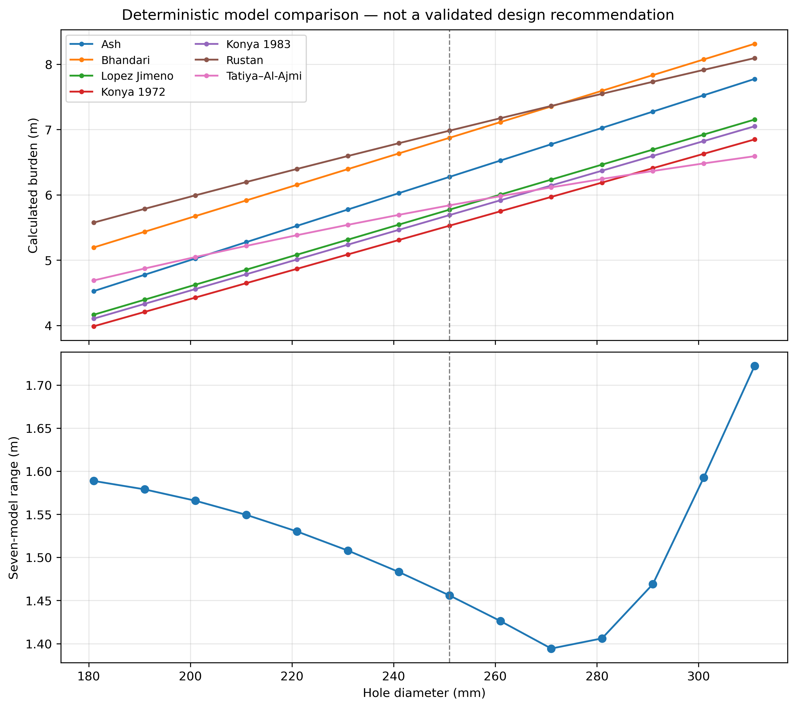

# Diameter Sensitivity Analysis

## Purpose

This analysis examines how seven reconstructed conventional burden models respond when hole diameter changes while all other reference inputs remain fixed.

It is a deterministic one-factor-at-a-time comparison. It is not a global sensitivity analysis, confidence interval, calibration study, or validated design recommendation.

## Fixed reference inputs

| Parameter | Value |
|---|---:|
| Reference hole diameter | 251 mm |
| Diameter comparison interval | 181–311 mm |
| Diameter increment | 10 mm |
| Uniaxial compressive strength | 85 MPa |
| Explosive density | 0.85 g/cm³ |
| Rock density | 4.37 g/cm³ |
| Explosive type | ANFO |
| Ash burden ratio | 25 |

## Results



*Hole diameter varies while the other reference inputs remain fixed. The upper panel shows seven deterministic burden-model outputs. The lower panel shows the difference between the largest and smallest output at each sampled diameter. The dashed line marks the 251 mm reference case.*

| Diameter, mm | Seven-model mean, m | Seven-model range, m |
|---:|---:|---:|
| 181 | 4.604860 | 1.588830 |
| 251 | 6.137371 | 1.455865 |
| 271 | 6.564139 | 1.394229 |
| 311 | 7.403812 | 1.722230 |

All seven calculated burdens increase with hole diameter, but their rates of increase differ.

Across the sampled values, the model range decreases from 1.588830 m at 181 mm to its sampled minimum of 1.394229 m at 271 mm, then increases to 1.722230 m at 311 mm.

This changing range results from differences in model functional form and changes in model ranking. It must not be interpreted as changing statistical confidence or evidence that the models become more accurate near 271 mm.

## Decision-safety interpretation

The ensemble mean is a descriptive comparison statistic and is not a recommended burden. The range represents structural disagreement among the seven equations, not probabilistically calibrated uncertainty.

The existing decision state therefore remains:

```text
Decision gate: RESEARCH_COMPARATOR_ONLY
Recommended burden: None
```

## Reproducibility

The calculations are implemented in:

```text
src/blastdesign/sensitivity.py
```

The figure and analysis can be reproduced using:

```text
notebooks/diameter_sensitivity_comparison.ipynb
```